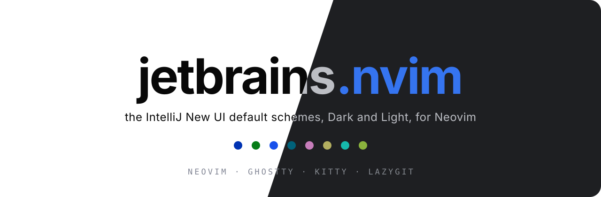
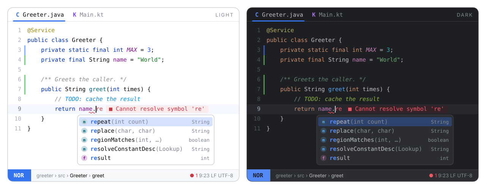

<p align="center">
  
</p>

<p align="center">
  <b>The IntelliJ New UI default schemes, for Neovim.</b><br>
  <i>Dark</i> and <i>Light</i> exactly as the IDE ships them: colors taken from the IntelliJ Platform source.
</p>

<p align="center">
  
  
  
</p>

---

<p align="center">
  
</p>

## Fidelity

Most "JetBrains" themes for Neovim copy colors from screenshots, or from the
old Darcula scheme. **jetbrains.nvim** reads them from the source: every
color in [`palette.lua`](lua/jetbrains/palette.lua) comes from the
[intellij-community](https://github.com/JetBrains/intellij-community) scheme
files of the **New UI** (the default since 2023), and the comment next to it
names the IntelliJ attribute it comes from:

| Variant | Editor scheme | UI theme |
| --- | --- | --- |
| `dark` | `expUI_darkScheme.xml` ("Dark", parent Darcula) | `expUI_dark.theme.json` |
| `light` | `expUI_lightScheme.xml` ("Light", parent Default) | `expUI_light.theme.json` |

The theme also follows how the IDE *uses* those colors, not just the hex values:

- **Declarations are colored, calls are not.** A function or method
  declaration is blue (`DEFAULT_FUNCTION_DECLARATION`); a call is plain text, as
  in Java, Kotlin and Python. Treesitter (`@function` vs `@function.call`) and
  LSP semantic tokens (the `declaration` modifier) both get this right. Set
  `colored_calls = true` for the JS/TS look, where calls are blue too.
- **Classes are plain text.** Class, interface and type references use the
  default text color. Primitive types (`int`, `boolean`) and `true`/`false`/`null`
  are keywords, so they take the keyword color.
- **Fields are purple; constants and statics are italic.** Instance fields and
  properties use `DEFAULT_INSTANCE_FIELD`; constants, enum members and static
  members are italic on top of their color.
- **Font styles per variant.** Line comments are italic in Light and upright in
  Dark; doc comments are italic in both; keywords are never bold. Exactly as
  the schemes define them.
- **The IDE's inspections.** Unresolved references turn red
  (`WRONG_REFERENCES_ATTRIBUTES`), unused code goes gray
  (`NOT_USED_ELEMENT_ATTRIBUTES`), reassigned or mutable variables are
  underlined, deprecated code is struck through, and misspelled words get the
  green `TYPO` wave, not a red one.
- **Language specifics** from the plugin schemes: Python `self` and builtins
  (`PY.SELF_PARAMETER`, `PY.BUILTIN_NAME`), decorators and annotations, docstrings
  as doc comments, HTML/XML tags, custom JSX components, regexes, Kotlin labels,
  Markdown code spans.
- **The IDE's UI.** Completion uses the lookup background and the blue list
  selection; matched characters use `CompletionPopup.matchForeground`; tabs get
  the accent underline; the gutter shows change markers in the IDE's colors
  (added green, modified blue, deleted gray); the terminal uses the Run console
  palette.

## Features

- Two variants, `light` and `dark`, plus `jetbrains`, which follows
  `'background'`. Neovim 0.10+ detects the terminal background (OSC 11), so the
  theme matches your terminal automatically.
- **Extreme performance.** Highlights are compiled to stripped LuaJIT
  bytecode with integer colors. A cached load is a single `loadfile()` and runs in
  **about 5 ms**, roughly 1.7× faster than the built-in `habamax`. The cache is
  keyed by a hash of your config, so it never goes stale.
- Built for **Neovim 0.12**. It covers every group the default colorscheme defines,
  plus `OkMsg`, `StderrMsg`, `StdoutMsg`, `DiffTextAdd`, `PmenuMatch`, `PmenuBorder`,
  `PmenuShadow`, `ComplMatchIns`, `SnippetTabstop*`, `DiagnosticVirtualLines*`,
  `LspReferenceTarget`, treesitter captures and LSP semantic tokens.
- **Matching themes for other tools**, generated from the same palette:
  Ghostty, Kitty and Lazygit.

## Supported plugins

| Plugin | Notes |
| --- | --- |
| [blink.cmp](https://github.com/saghen/blink.cmp) | lookup popup, docs, signature, ghost text, **colored kinds** (also `CmpItemKind*`) |
| [mini.icons](https://github.com/echasnovski/mini.icons) | icon colors from the New UI color ramps |
| [mini.pick](https://github.com/echasnovski/mini.pick) / [mini.extra](https://github.com/echasnovski/mini.extra) | |
| [mini.files](https://github.com/echasnovski/mini.files) | |
| [mini.tabline](https://github.com/echasnovski/mini.tabline) | accent underline on the current buffer, modified buffers in the `FILESTATUS_MODIFIED` blue |
| [gitsigns.nvim](https://github.com/lewis6991/gitsigns.nvim) | gutter markers, `numhl`, `linehl` with the diff viewer colors, inline, preview, staged, blame |
| [dropbar.nvim](https://github.com/Bekaboo/dropbar.nvim) | breadcrumbs, kind icons colored like the completion menu |
| [grug-far.nvim](https://github.com/MagicDuck/grug-far.nvim) | |
| [mason.nvim](https://github.com/mason-org/mason.nvim) | |
| [lazy.nvim](https://github.com/folke/lazy.nvim) | |
| [nvim-treesitter](https://github.com/nvim-treesitter/nvim-treesitter) | captures incl. `@markup.*`, `@diff.*`, `@comment.todo`, per-language overrides |

## Installation

[lazy.nvim](https://github.com/folke/lazy.nvim):

```lua
{
  "amonteirom96/jetbrains.nvim",
  lazy = false,
  priority = 1000,
  opts = {},
  config = function(_, opts)
    require("jetbrains").setup(opts)
    vim.cmd.colorscheme("jetbrains")
  end,
}
```

No `build` step is needed: the cache is keyed by the plugin version and your
config, so an update recompiles on its own.

Native `vim.pack` (Neovim 0.12):

```lua
vim.pack.add({ "https://github.com/amonteirom96/jetbrains.nvim" })
require("jetbrains").setup({})
vim.cmd.colorscheme("jetbrains")
```

### Colorschemes

| Command | Behavior |
| --- | --- |
| `:colorscheme jetbrains` | follows `'background'` (or the `variant` option) |
| `:colorscheme jetbrains-light` | always Light |
| `:colorscheme jetbrains-dark` | always Dark |

## Configuration

Calling `setup()` is optional. These are the defaults:

```lua
require("jetbrains").setup({
  variant = "auto",          -- "auto" (follow 'background') | "light" | "dark"
  transparent = false,       -- no background on Normal, floats and the sign column
  terminal_colors = true,    -- set g:terminal_color_0..15 (the IDE console palette)
  dim_inactive = false,      -- slightly different background on unfocused windows
  colored_calls = false,     -- color calls like declarations (JS/TS look)
  underline_mutable = true,  -- underline reassigned / mutable variables (semantic tokens)
  float = {
    solid = false,           -- filled floats with an invisible border
  },
  -- Any nvim_set_hl attributes, merged over the IDE's own styles (comments
  -- italic in Light, doc comments and constants italic in both).
  styles = {
    comments = {},
    doc_comments = {},
    keywords = {},
    functions = {},          -- declarations
    calls = {},              -- function and method calls
    variables = {},
    fields = {},
    strings = {},
    numbers = {},
    types = {},
    constants = {},
    operators = {},
  },
  integrations = {           -- set to false to skip a plugin's groups
    blink = true,
    dropbar = true,
    gitsigns = true,
    grug_far = true,
    lazy = true,
    mason = true,
    mini = true,             -- icons, pick, extra, files, tabline
    semantic_tokens = true,
    statusline = true,       -- St* groups for a custom statusline
    treesitter = true,
  },
  cache = true,              -- compile to bytecode (turn off only while hacking on the theme)

  --- Change the palette before any highlight is built.
  ---@param colors jetbrains.Colors
  ---@param variant "light"|"dark"
  on_colors = function(colors, variant) end,

  --- Add or change highlight groups.
  ---@param hl table<string, vim.api.keyset.highlight>
  ---@param colors jetbrains.Colors
  ---@param variant "light"|"dark"
  on_highlights = function(hl, colors, variant) end,
})
```

### Examples

**Bold keywords and no italics**, like the classic Darcula:

```lua
require("jetbrains").setup({
  styles = {
    keywords = { bold = true },
    comments = { italic = false },
    doc_comments = { italic = false },
    constants = { italic = false },
  },
})
```

**JS/TS look everywhere** (calls in the declaration blue):

```lua
require("jetbrains").setup({ colored_calls = true })
```

**Darker editor, panels one step lighter:**

```lua
require("jetbrains").setup({
  on_colors = function(c, variant)
    if variant == "dark" then
      c.bg = "#191a1c"
      c.panel = "#1e1f22"
    end
  end,
})
```

**Custom statusline groups:**

```lua
require("jetbrains").setup({
  on_highlights = function(hl, c)
    local modes = {
      Normal = c.accent, Insert = c.green, Visual = c.purple,
      Replace = c.orange, Command = c.yellow, Other = c.teal,
    }
    for mode, color in pairs(modes) do
      hl["StMode" .. mode] = { fg = c.on_accent, bg = color, bold = true }
      hl["StMode" .. mode .. "Sep"] = { fg = color, bg = c.panel }
    end
  end,
})
```

## Palette

The main colors. The full list, with the IntelliJ attribute of each one, is in
[`lua/jetbrains/palette.lua`](lua/jetbrains/palette.lua).

| Key | Light | Dark | IntelliJ attribute |
| --- | --- | --- | --- |
| `bg` | `#ffffff` | `#1e1f22` | `TEXT` background |
| `fg` | `#080808` | `#bcbec4` | `TEXT` foreground: identifiers, calls, classes |
| `keyword` | `#0033b3` | `#cf8e6d` | `DEFAULT_KEYWORD` (also `true`/`false`/`null`, primitives) |
| `string` | `#067d17` | `#6aab73` | `DEFAULT_STRING` |
| `number` | `#1750eb` | `#2aacb8` | `DEFAULT_NUMBER` |
| `comment` | `#8c8c8c` | `#7a7e85` | `DEFAULT_LINE_COMMENT` |
| `doc_comment` | `#8c8c8c` | `#5f826b` | `DEFAULT_DOC_COMMENT` |
| `func` | `#00627a` | `#56a8f5` | `DEFAULT_FUNCTION_DECLARATION` |
| `field` | `#871094` | `#c77dbb` | `DEFAULT_INSTANCE_FIELD`, `DEFAULT_CONSTANT` |
| `annotation` | `#9e880d` | `#b3ae60` | `DEFAULT_METADATA` |
| `type_param` | `#007e8a` | `#16baac` | `TYPE_PARAMETER_NAME_ATTRIBUTES` |
| `tag` | `#0033b3` | `#d5b778` | `HTML_TAG_NAME` |
| `todo` | `#008dde` | `#8bb33d` | `TODO_DEFAULT_ATTRIBUTES` |
| `caret_row` | `#f5f8fe` | `#26282e` | `CARET_ROW_COLOR` |
| `selection` | `#a6d2ff` | `#214283` | `SELECTION_BACKGROUND` |
| `search` | `#fcd47e` | `#114957` | `TEXT_SEARCH_RESULT_ATTRIBUTES` |
| `ref` | `#edebfc` | `#373b39` | `IDENTIFIER_UNDER_CARET_ATTRIBUTES` |
| `popup` | `#ffffff` | `#2b2d30` | `LOOKUP_COLOR` |
| `list_sel` | `#d4e2ff` | `#2e436e` | `selectionBackground` (theme) |
| `accent` | `#3574f0` | `#3574f0` | `focusColor` (theme) |

UI keys (`panel`, `popup_border`, `border`, `hover`, `muted`, `subtle`, `match`),
diff and VCS keys (`diff_*`, `gutter_*`, `vcs_*`) and diagnostics (`error`,
`warn`, `info`, `hint`, `ok`) come from the same files. `red`, `orange`,
`yellow`, `green`, `teal`, `blue` and `purple` are taken from the New UI color
ramps and are used only for icons, kinds and the statusline, never in code.

A few official colors sit below WCAG AA, as they do in the IDE: gray comments,
Light annotations and TODOs (≥ 3:1) and, in Dark, Python `self` and keyword
arguments. `scripts/contrast.lua` reports every value. Diagnostics in Light use
the New UI ramps instead of the scheme's pure `#ff0000`, so the virtual text stays readable.

Use the palette in your own config:

```lua
local c = require("jetbrains").colors()        -- current variant
local light = require("jetbrains").colors("light")
local groups = require("jetbrains").highlights("dark")
```

## Extras

Themes for other tools live in [`extras/`](extras). They are generated from the
palette and include your `on_colors` overrides when you regenerate them:

```vim
:JetbrainsExtras [output-dir]
```

| Tool | Files | Setup |
| --- | --- | --- |
| **Ghostty** | `extras/ghostty/jetbrains-{light,dark}` | copy to `~/.config/ghostty/themes/`, then `theme = light:jetbrains-light,dark:jetbrains-dark` |
| **Kitty** | `extras/kitty/jetbrains-{light,dark}.conf` | copy them to `~/.config/kitty/light-theme.auto.conf` and `dark-theme.auto.conf` to follow the OS theme, or `include` one |
| **Lazygit** | `extras/lazygit/jetbrains-{light,dark}.yml` | `LG_CONFIG_FILE=~/.config/lazygit/config.yml,~/.config/lazygit/jetbrains-dark.yml` |

The 16 ANSI colors are the IDE's console palette (`CONSOLE_*_OUTPUT`), so a
terminal prints exactly what the Run tool window does. Lazygit's diff colors
come from those ANSI colors, so they follow the Ghostty or Kitty theme.

## Commands

| Command | Description |
| --- | --- |
| `:JetbrainsCompile` | Rebuild the bytecode cache. Updates recompile on their own; run it after changing values captured inside an `on_*` closure. |
| `:JetbrainsClearCache` | Delete the cache (`stdpath("cache")/jetbrains`). |
| `:JetbrainsExtras [dir]` | Generate the Ghostty, Kitty and Lazygit themes. |

## Development

```sh
# contrast report (fails only if a syntax color drops under 3:1)
nvim --headless -u NONE --cmd "set rtp^=." -l scripts/contrast.lua
# smoke tests (also checks every main color against the official IntelliJ values)
nvim --headless -u NONE --cmd "set rtp^=." -l tests/smoke.lua
# load-time benchmark
nvim --headless -u NONE --cmd "set rtp^=." -l scripts/bench.lua
# regenerate extras and README images from the palette
nvim --headless -u NONE --cmd "set rtp^=." -c "lua require('jetbrains').extras()" -c q
nvim --headless -u NONE --cmd "set rtp^=." -l scripts/assets.lua
```

When you change highlight definitions, bump `M.version` in
`lua/jetbrains/init.lua`. This invalidates every user's compiled cache.

## Credits

Colors from the IntelliJ Platform's
[New UI color schemes](https://github.com/JetBrains/intellij-community/tree/master/platform/platform-resources/src/themes/expUI)
(Apache 2.0). Structure based on
[onemono.nvim](https://github.com/amonteirom96/onemono.nvim).

This is an unofficial port. It is not affiliated with or endorsed by JetBrains;
JetBrains and IntelliJ are trademarks of JetBrains s.r.o.

## License

[MIT](LICENSE)
